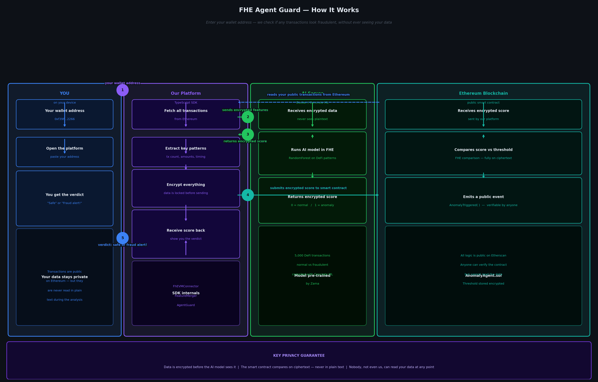
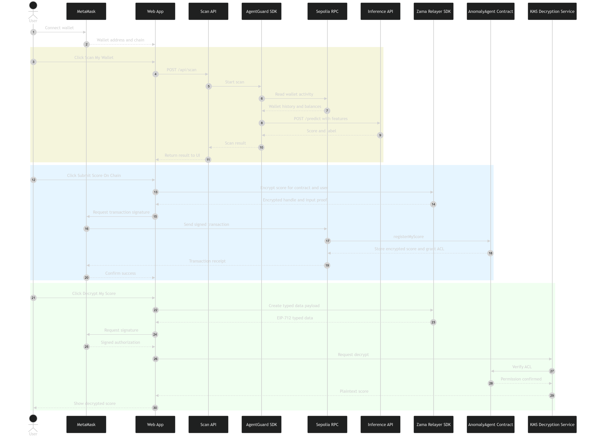

<div align="center">

<br/>


<br/><br/>

# Confidential On-Chain Risk Scanning with FHE

### *Detect suspicious wallet behavior without exposing raw features or plaintext scores.*

<br/>

[](https://www.zama.ai/)
[]()
[]()
[]()
[]()
[]()

<br/>

---

<table width="100%">
<tr>
<td width="100%" valign="top" align="center">

**📖 &nbsp;Project**

[Overview](#-overview) &nbsp;·&nbsp; [Why it matters](#-why-it-matters) &nbsp;·&nbsp; [Architecture](#-architecture) &nbsp;·&nbsp; [How the flow works](#-how-the-flow-works) &nbsp;·&nbsp; [Repository structure](#-repository-structure)

</td>
</tr>
<tr>
<td width="100%" valign="top" align="center">

**🛠️ &nbsp;Build and run**

[Prerequisites](#-prerequisites) &nbsp;·&nbsp; [Environment](#-environment) &nbsp;·&nbsp; [Local setup](#-local-setup) &nbsp;·&nbsp; [Sepolia deployment](#-sepolia-deployment)

</td>
</tr>
</table>

---

</div>

<br/>

## 🔍 Overview

**FHE Agent Guard** is a confidential anomaly-detection system for on-chain activity.

It scans wallet behavior, derives a small set of transaction features, sends them to a **Concrete ML** inference service, encrypts the resulting score using **Zama's relayer SDK**, submits that encrypted score **on-chain**, and allows the wallet owner to decrypt the result later through **MetaMask + KMS authorization**.

The goal is simple:

> **Detect risky wallet behavior without putting plaintext scores or sensitive intermediate data on-chain.**

<br/>

## ⚡ Why it matters

Most risk engines and fraud tools rely on off-chain scoring and plaintext data pipelines. That makes them hard to verify, hard to integrate with smart contracts, and easy to overexpose.

**FHE Agent Guard** keeps the result confidential while still making it usable on-chain:

- **Client-side submission** of encrypted anomaly scores
- **On-chain storage** of FHE-protected values
- **User-scoped ACL permissions** for decryption
- **MetaMask-based authorization** for decrypting the score
- **Sepolia-first architecture**, with Mainnet reserved for a later rollout

<br/>

## 🏛️ Architecture

<div align="center">
  
</div>

<div align="center">
  
</div>

<br/>

## 🔄 How the flow works

1. The user connects **MetaMask** on **Sepolia**.
2. The web app scans the wallet and builds the feature vector.
3. The feature vector is sent to the **inference API server**.
4. The model returns an anomaly score / label.
5. The frontend encrypts the score with the **Zama relayer SDK**.
6. The encrypted handle and proof are submitted to **`AnomalyAgent.sol`** on-chain.
7. The contract stores the encrypted score and grants the right ACL permissions.
8. When the user clicks **Decrypt My Score**, MetaMask signs the EIP-712 payload.
9. The KMS verifies permissions and returns the plaintext score to the frontend.

<br/>

## 🧩 Repository structure

```text
apps/
└── demo/                  Next.js demo app

packages/
├── contracts/             Hardhat project and AnomalyAgent contract
├── sdk/                   TypeScript SDK and FHE helpers
├── models/                Concrete ML training / compilation pipeline
└── inference-server/      FastAPI inference server
```

## 🛠️ Prerequisites
- Node.js 20+
- pnpm
- Docker Desktop
- MetaMask
- Sepolia ETH for contract interaction
  
## 🔧 Environment

Create these files before running the project.

1. Root `.env` based on root `.env.example`
2. `apps/demo/.env.local` based on `.env.example` in that same path
3. `packages/contracts/.env` based on `.env.example` in that same path

## 🚀 Local setup

Install dependencies:
```bash
pnpm install
```

Build and start the inference server:
```bash
pnpm inference:build
pnpm inference:start
```

Compile and deploy the contract:
```bash
pnpm --filter @fhe-guard/contracts compile
pnpm deploy:sepolia
pnpm contracts:export:sepolia
```

Run the demo:
```bash
pnpm demo
```

Open `http://localhost:3000`

## 🌐 Sepolia deployment

The current supported network is:

- Sepolia ✅
- Ethereum Mainnet 🚧 Coming Soon

After deploying to Sepolia, update `NEXT_PUBLIC_ANOMALY_AGENT_SEPOLIA=0x...` in `apps/demo/.env.local`. Then restart the demo app.

## 🧪 Typical user flow
1. Connect wallet
2. Click Scan My Wallet
3. Review the returned anomaly result
4. Click Submit Score On-Chain
5. Wait for confirmation
6. Click Decrypt My Score
7. Sign with MetaMask
8. View the decrypted score